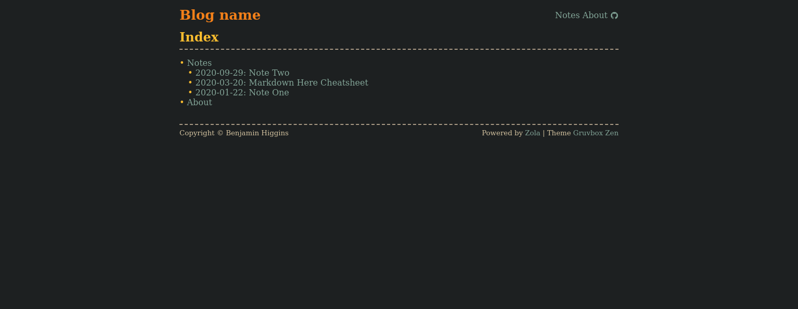
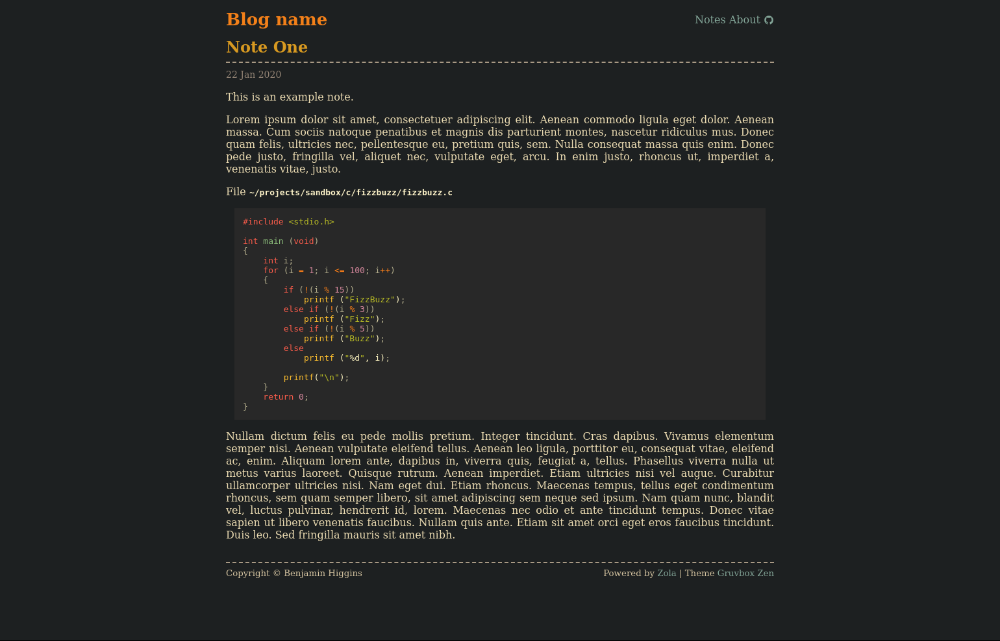

# Gruvbox Zen

A [Zola](https://www.getzola.org/) theme forked from [Oceanic
Zen](https://github.com/brhigginsuk/gruvbox-zen).

## Changes
- Updated colours, sourced from the [gruvbox theme](https://github.com/morhetz/gruvbox).
- Removed included font, system font should be used instead
- Added some extra social icons




## Installation

Download theme to your `themes` directory:

```bash
$ cd themes
$ git clone https://github.com/brhigginsuk/gruvbox-zen.git
```

Or add as git submodule

```bash
$ git submodule add https://github.com/brhigginsuk/gruvbox-zen.git themes/gruvbox-zen
```

Enable it in your `config.toml`:

```toml
theme = "gruvbox-zen"
```

## Options

Theme supported some extra options

```toml
[extra]
author = "blog author name"
github = "github author name"
twitter = "twitter author name"
sourcehut = "sourcehut author name"
email = "author email address"
rss = "RSS file name (atom.xml by default)"
pgp = "PGP key file name"
```
